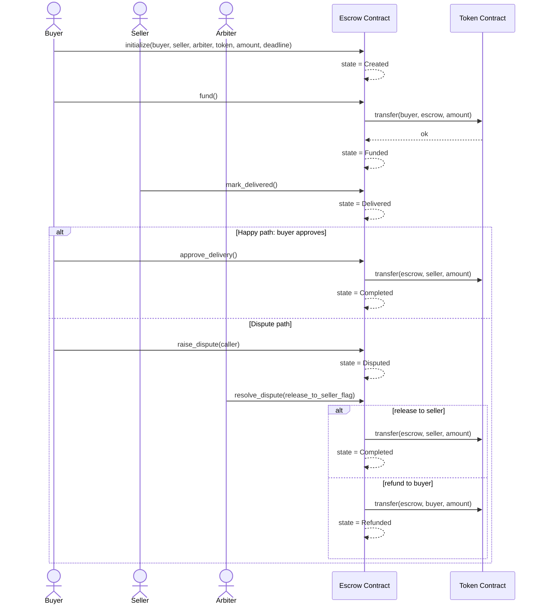
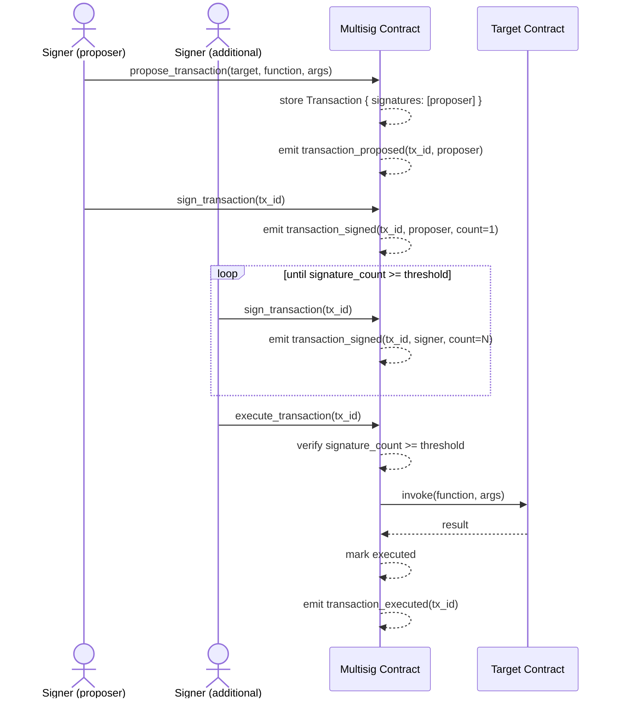

# System Architecture

This document describes the high-level design of the Soroban starter kit: how contracts relate, storage choices, the event model, and the admin framework.

## Contract Relationship Diagram

```
┌─────────────────────────────────────────────────────────────┐
│                    Soroban Starter Kit                      │
└─────────────────────────────────────────────────────────────┘
                              │
                ┌─────────────┴─────────────┐
                │                           │
        ┌───────▼────────┐         ┌───────▼────────┐
        │  Token Contract│         │ Escrow Contract│
        │                │         │                │
        │ • Mint/Burn    │         │ • Two-party    │
        │ • Transfer     │         │   transactions │
        │ • Allowances   │         │ • Dispute      │
        │ • Admin        │         │   resolution   │
        └────────────────┘         └────────────────┘
                │                           │
                │                           │
                └───────────────┬───────────┘
                                │
                    ┌───────────▼──────────┐
                    │  soroban-common      │
                    │                      │
                    │ • AdminKey enum      │
                    │ • TTL constants      │
                    │ • Shared utilities   │
                    └──────────────────────┘
```

### Token Contract

The **Token** contract implements a custom fungible token with full Soroban token interface compatibility. It manages:

- **Balances**: Per-account token holdings (persistent storage)
- **Allowances**: Approve-and-transfer-from mechanism (persistent storage)
- **Metadata**: Name, symbol, decimals (instance storage)
- **Admin**: Single privileged address for mint/burn operations (instance storage)

**Key features:**
- Standard Soroban token interface (transfer, approve, balance_of, etc.)
- Mint and burn operations restricted to admin
- Allowance expiry support
- Optional feature flags: `pausable`, `freeze`, `capped-supply`

### Escrow Contract

The **Escrow** contract implements a two-party transaction with optional arbiter dispute resolution. It manages:

- **Parties**: Buyer, seller, arbiter (instance storage)
- **Funds**: Escrowed token amount and contract reference (instance storage)
- **Lifecycle**: State machine tracking the escrow progression (instance storage)
- **Deadline**: Ledger sequence number for refund eligibility (instance storage)

**Key features:**
- Strict state machine: Created → Funded → Delivered → Completed (or Refunded/Cancelled)
- Deadline-based refund mechanism
- Arbiter-mediated dispute resolution
- Partial release for milestone-based payments
- Token-agnostic (works with any Soroban token)

### Shared Utilities (soroban-common)

The **soroban-common** crate provides:

- `AdminKey` enum: Canonical storage key for admin addresses
- `get_admin()` / `try_get_admin()`: Safe admin retrieval
- TTL constants: `LEDGER_LIFETIME_THRESHOLD`, `LEDGER_BUMP_AMOUNT`
- Helper functions: `extend_ttl_instance()`, `extend_ttl_persistent()`

This eliminates duplication and ensures consistent admin and TTL handling across contracts.

---

## Storage Tier Choices

Soroban provides three storage tiers with different TTL and cost characteristics:

| Tier | TTL Behavior | Cost | Use Case |
|------|--------------|------|----------|
| **Instance** | Single TTL for all keys | Lowest | Small, always-needed state |
| **Persistent** | Per-key TTL; survives upgrades | Medium | Long-lived, per-user data |
| **Temporary** | Per-key TTL; auto-deleted on expiry | Lowest | Short-lived, scratch data |

### Token Contract Storage

| Data | Tier | Rationale |
|------|------|-----------|
| `Admin`, `TotalSupply`, `Metadata` | Instance | Global, always needed, small |
| `Balance(Address)` | Persistent | Per-user, potentially numerous; inactive balances can expire |
| `Allowance(AllowanceDataKey)` | Persistent | Per-user, carries expiry semantics; aligns with allowance TTL |

**Rationale:** Persistent storage for balances and allowances allows dormant accounts to expire without affecting the contract instance, reducing on-chain bloat. Instance storage for global state simplifies TTL management.

### Escrow Contract Storage

| Data | Tier | Rationale |
|------|------|-----------|
| All fields (`Buyer`, `Seller`, `Arbiter`, `TokenContract`, `Amount`, `Deadline`, `State`) | Instance | Single, atomic agreement; all fields read together; single-use contract |

**Rationale:** An escrow is a single, atomic agreement with a fixed set of parties. Instance storage provides a single TTL to manage, simplifying the bump logic. The contract is single-use (one escrow per deployed instance), so per-key granularity adds no benefit.

### TTL / Bump Strategy

Both contracts define:

```rust
const LEDGER_LIFETIME_THRESHOLD: u32 = 120_960;  // ~7 days
const LEDGER_BUMP_AMOUNT: u32 = 518_400;         // ~30 days
```

**Bump logic:**
- `bump_instance()` is called on every state-mutating function
- `bump_persistent()` is called when reading/writing persistent keys
- If remaining TTL < `LEDGER_LIFETIME_THRESHOLD`, extend to `LEDGER_BUMP_AMOUNT`

**Consequence:** Active contracts never expire unexpectedly. Callers must periodically invoke state-mutating functions to keep long-running escrows alive.

---

## Event Model and Indexing Guidance

All contracts emit events for state changes, enabling off-chain indexing and monitoring.

### Token Contract Events

| Event | Topics | Data | Use |
|-------|--------|------|-----|
| `initialized` | (Symbol, Address) | (name, symbol, decimals) | Track token creation |
| `mint` | (Symbol, Address) | amount | Index minting activity |
| `burn` | (Symbol, Address) | amount | Index burning activity |
| `transfer` | (Symbol, Address, Address) | amount | Index transfers |
| `approve` | (Symbol, Address, Address) | amount | Index allowance grants |
| `revoke` | (Symbol, Address, Address) | () | Index allowance revocations |
| `admin_changed` | (Symbol, Address) | new_admin | Track admin transitions |
| `paused` | (Symbol, Address) | () | Track pause state (feature: `pausable`) |
| `unpaused` | (Symbol, Address) | () | Track unpause state (feature: `pausable`) |

### Escrow Contract Events

| Event | Topics | Data | Use |
|-------|--------|------|-----|
| `initialized` | (Symbol, Address, Address, Address) | amount | Track escrow creation |
| `escrow_funded` | (Symbol, Address) | amount | Index funding |
| `delivery_marked` | (Symbol, Address) | () | Track delivery claims |
| `funds_released` | (Symbol, Address) | amount | Index completions |
| `funds_refunded` | (Symbol, Address) | amount | Index refunds |
| `partial_release` | (Symbol, Address) | amount | Track milestone payments |

### Indexing Recommendations

**For Token:**
- Index `transfer` events to build account balance history
- Index `approve` events to track allowance grants
- Index `mint` / `burn` to monitor supply changes
- Use `admin_changed` to audit privilege escalations

**For Escrow:**
- Index `initialized` to discover new escrows
- Index state transitions (`funded`, `delivery_marked`, `funds_released`, `funds_refunded`) to track lifecycle
- Index `partial_release` to identify milestone-based payments
- Correlate events across token and escrow contracts to trace fund flows

---

## Admin Model

### Token Contract: Single Admin

The token contract uses a **single admin address** stored in instance storage:

```rust
pub enum AdminKey {
    Admin,  // Stored in instance storage
}
```

**Privileged operations:**
- `mint(to, amount)` — Only admin can mint
- `burn(from, amount)` — Only admin can burn
- `set_admin(new_admin)` — Only admin can transfer admin role

**Authentication:** All privileged operations call `admin.require_auth()`, delegating to Soroban's native auth framework.

**Multi-sig support:** The admin address can be a multisig contract. Operators who need multi-party control should deploy a multisig contract as the admin address.

**Immutability:** Setting the admin to a burn address (e.g., `GAAAAAAAAAAAAAAAAAAAAAAAAAAAAAAAAAAAAAAAAAAAAAAAAAAAAWHF`) effectively makes the token immutable.

### Escrow Contract: Role-Based Parties

The escrow contract has **no global admin**. Instead, three distinct roles are established at initialization:

| Role | Stored Key | Privileged Operations |
|------|-----------|----------------------|
| **Buyer** | `Buyer` | `fund`, `approve_delivery`, `request_refund`, `release_partial`, `cancel` |
| **Seller** | `Seller` | `mark_delivered` |
| **Arbiter** | `Arbiter` | `resolve_dispute` |

**Authentication:** Each function reads the relevant address from storage and calls `.require_auth()` on it.

**Dispute resolution:** The arbiter can call `resolve_dispute` to either complete or refund the escrow, but has no power in terminal states.

**No super-admin:** There is no address that can override all roles. This prevents a single point of failure.

### Shared Admin Utilities

The `soroban-common` crate provides:

```rust
pub fn get_admin(env: &Env) -> Address { /* panics if unset */ }
pub fn try_get_admin(env: &Env) -> Option<Address> { /* returns None if unset */ }
```

This is the single source of truth for admin storage and retrieval, ensuring consistency across contracts.

---

## Feature Flag Matrix

The token contract supports optional features via Cargo feature flags:

| Feature | Description | Impact |
|---------|-------------|--------|
| `pausable` | Admin can pause/unpause transfers | Adds `pause()`, `unpause()` functions; emits `paused`/`unpaused` events |
| `freeze` | Admin can freeze individual accounts | Adds `freeze(account)`, `unfreeze(account)` functions; blocks transfers from frozen accounts |
| `capped-supply` | Token has a maximum supply cap | Enforces cap on `mint()`; rejects mints that would exceed cap |

**Usage:**

```bash
# Build with pausable feature
cargo build --features pausable

# Build with multiple features
cargo build --features pausable,freeze,capped-supply

# Build with all features
cargo build --all-features
```

**Default:** No features enabled. The token is fully functional without any feature flags.

---

## State Machine: Escrow Lifecycle

The escrow contract enforces a strict state machine to prevent fund loss or double-spending:

```
Created ──fund()──► Funded ──mark_delivered()──► Delivered
   │                  │  ▲                           │  ▲
cancel()      raise_dispute()                 raise_dispute()
   │                  │  │                           │  │
   ▼                  ▼  │                           ▼  │
Cancelled          Disputed ────────────────────────────┘
                       │
         ┌─────────────┼───────────────────────────┐
         ▼              ▼                           ▼
  resolve_dispute   resolve_dispute          claim_dispute_timeout()
  (release_to_      (release_to_              buyer-only, once
   seller: true)     seller: false)         DisputeTimeoutLedgers elapse
         │              │                           │
         ▼              ▼                           ▼
    Completed        Refunded ◄─────────────────────┘
```

**Additional entry points not shown above** (kept off the diagram to avoid clutter, listed in the transition table below): `approve_delivery()` (`Delivered` → `Completed`), `request_refund()` / `request_partial_refund()` (→ `Refunded`), and `release_milestone()` (`Funded` → `Completed`, milestone-based escrows only).

### State Definitions

| State | Meaning | Terminal |
|-------|---------|----------|
| `Created` | Escrow initialized; no funds held | No |
| `Funded` | Buyer transferred tokens to contract | No |
| `Delivered` | Seller marked goods/services delivered | No |
| `Disputed` | Escrow under arbiter review | No |
| `Completed` | Funds released to seller | **Yes** |
| `Refunded` | Funds returned to buyer | **Yes** |
| `Cancelled` | Buyer cancelled before funding | **Yes** |

### Transition Rules

Every entry point reads the current state first and rejects invalid transitions with `EscrowError::InvalidState`.

**Valid transitions:**
- `Created` → `Funded` (via `fund()`, buyer)
- `Created` → `Cancelled` (via `cancel()`, buyer)
- `Funded` → `Delivered` (via `mark_delivered()`, seller)
- `Funded` → `Disputed` (via `raise_dispute()`, buyer or seller)
- `Delivered` → `Disputed` (via `raise_dispute()`, buyer or seller)
- `Delivered` → `Completed` (via `approve_delivery()`, buyer)
- `Funded` → `Completed` (via `release_milestone()` once every milestone has been released — milestone-based escrows only; other escrows never take this path)
- `Funded` → `Refunded` (via `request_refund()` after `deadline_ledger`, buyer; or `request_partial_refund()` at any time while `Funded`, buyer)
- `Delivered` → `Refunded` (via `request_refund()` after `deadline_ledger`, buyer)
- `Disputed` → `Completed` (via `resolve_dispute(release_to_seller: true)`, arbiter — internally passes through `Delivered` within the same call)
- `Disputed` → `Refunded` (via `resolve_dispute(release_to_seller: false)`, arbiter; or `claim_dispute_timeout()` once `DisputeTimeoutLedgers` has elapsed since the dispute was raised, buyer — both internally pass through `Funded` within the same call)

**Not a state transition:** `release_partial(amount)` pays out part of the escrowed amount to the seller while remaining in `Funded` — it decrements the stored `Amount` without changing `State`, distinct from `release_milestone()` above which is specific to milestone-based escrows and does terminate in `Completed`.

---

## Sequence Diagrams

### Escrow Lifecycle

Covers initialization, funding, the happy-path release, and the dispute path.



### Multisig Lifecycle

Covers proposing a transaction, collecting threshold signatures, and execution against the target contract.



### Checks-Effects-Interactions (CEI) Pattern

All token transfers happen **after** state is updated:

```rust
// Effects first
env.storage().instance().set(&State, &EscrowState::Completed);
bump_instance(&env);
// Interactions last
token::Client::new(&env, &token_contract).transfer(…);
```

This prevents re-entrancy: if the token transfer triggers a re-entrant call, the state is already terminal and all state-guarded functions return `InvalidState`.

### Deadline Enforcement

The `deadline_ledger` is a Soroban ledger sequence number set at initialization. It must be at least `MIN_DEADLINE_BUFFER` (10) ledgers in the future.

- `request_refund()` is only valid when `env.ledger().sequence() > deadline` **and** state is `Funded` or `Delivered`
- There is no automatic expiry; the buyer must explicitly call `request_refund()`

### Partial Release

`release_partial(amount)` allows the buyer to release a portion of funds to the seller while the escrow remains in `Funded` or `Delivered` state. The stored `Amount` is decremented; the state does not change. This enables milestone-based payments without requiring a new escrow deployment.

---

## Error Handling

### Token Contract Errors

| Code | Name | Description |
|------|------|-------------|
| 1 | `InsufficientBalance` | Caller's balance is too low |
| 2 | `InsufficientAllowance` | Approved allowance is too low |
| 3 | `Unauthorized` | Caller is not the admin |
| 4 | `AlreadyInitialized` | `initialize` called on initialized contract |
| 5 | `NotInitialized` | Operation attempted before initialization |
| 6 | `InvalidAmount` | Amount is zero, negative, or exceeds max supply |
| 7 | `Overflow` | Arithmetic overflow during calculation |

### Escrow Contract Errors

| Code | Name | Description |
|------|------|-------------|
| 1 | `NotAuthorized` | Caller is not permitted for this operation |
| 2 | `InvalidState` | Escrow is not in the required state |
| 3 | `DeadlinePassed` | Deadline has elapsed; operation no longer valid |
| 4 | `DeadlineNotReached` | Deadline has not passed; premature operation |
| 5 | `AlreadyInitialized` | `initialize` called on initialized escrow |
| 6 | `NotInitialized` | Operation attempted before initialization |
| 7 | `InsufficientFunds` | Buyer's balance is too low |
| 8 | `InvalidAmount` | Amount is zero or otherwise invalid |
| 9 | `InvalidParties` | Addresses are invalid or conflict |

---

## Deployment and Lifecycle

### Single-Use Escrow Pattern

Each escrow contract instance is **single-use**: one escrow per deployed contract. Once an escrow reaches a terminal state (`Completed`, `Refunded`, or `Cancelled`), a new contract instance must be deployed for a new escrow.

**Rationale:** Simplifies state management and prevents accidental fund mixing.

### Token Contract Reusability

The token contract is **reusable**: a single deployed token contract can mint, burn, and transfer indefinitely. Multiple accounts can hold balances and allowances.

### TTL Management

- **Active contracts:** Bump TTL on every state-mutating operation; never expire unexpectedly
- **Dormant contracts:** If no operations occur for ~7 days, TTL falls below threshold and contract expires
- **Reactivation:** Calling any state-mutating function re-extends TTL to ~30 days

---

## Security Considerations

See [security.md](security.md) for detailed security analysis, including:
- Re-entrancy prevention (CEI pattern)
- Authorization checks
- State machine invariants
- Overflow/underflow protection
- Deadline enforcement

---

## References

- [ADR-0001: Storage Tier Choices](adr/0001-storage-tier-choices.md)
- [ADR-0003: Admin Model](adr/0003-admin-model.md)
- [ADR-0004: Escrow State Machine Design](adr/0004-escrow-state-machine.md)
- [Storage Layout Documentation](storage-layout.md)
- [Integration Guide](integration-guide.md)
- [Deployment Guide](deployment-guide.md)
